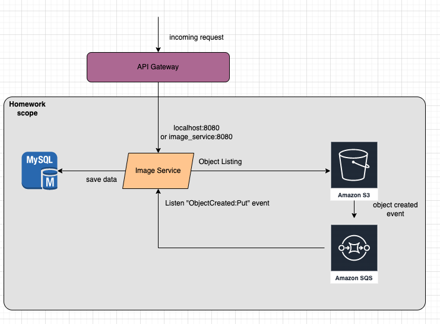

#Oyika Assignment Homework

AWS S3 bucket is an object storage used to store data such images. Now you have a bucket which contains many images. Build a sprint boot microservice with following functions
1) loop through the images in the S3 bucket
2) store them in mysql table (design your own table schema )
3) a simple fetchImages API to return all the images in the JSON response

Bonus:
The bucket is constantly updated with new image. Write an efficient logic to update these new image data in the mysql table.

## Technologies
1. Java 1.8
2. Spring Boot 2.7.7
3. S3
4. SQS

## System Design
Because of the scope of topic, so that I just have built a simple service with these above feature, and skip perform authenticate and authorized user access API.
I exposed two APIs include: 
  1. "/api/v1.0/images/sync" -> to sync all the items in the specific bucket store down database.
  2. "/api/v1.0/images" -> to fetch all the images.

I also create a listener to listen when the bucket hava an event and will send message (include information of event) to application, and we will store it down database.

