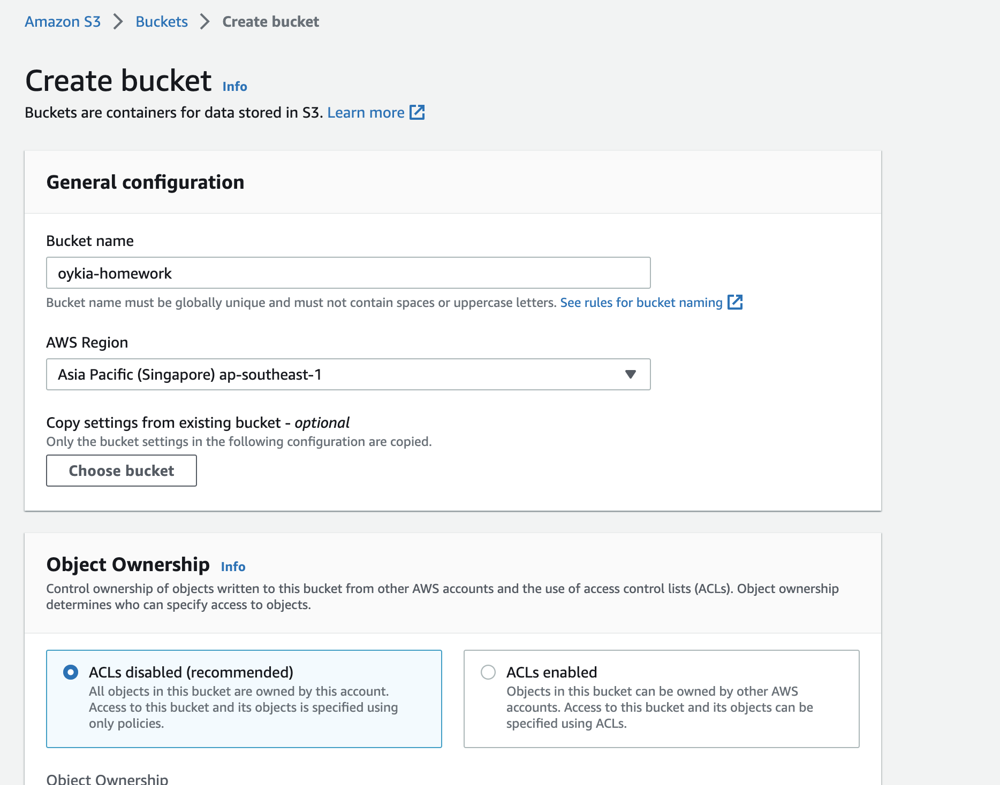
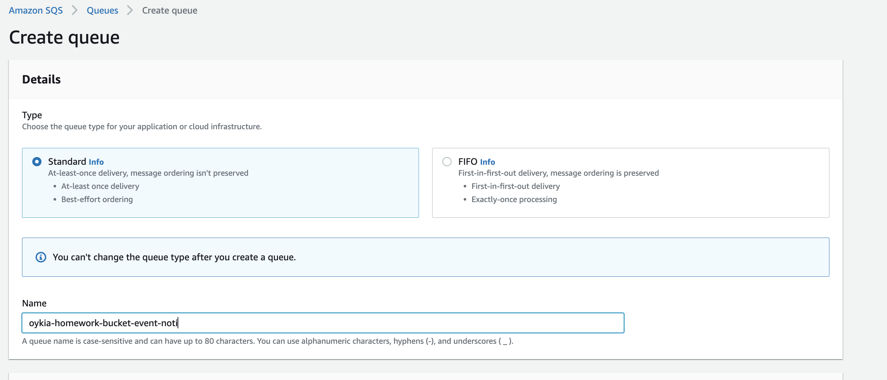
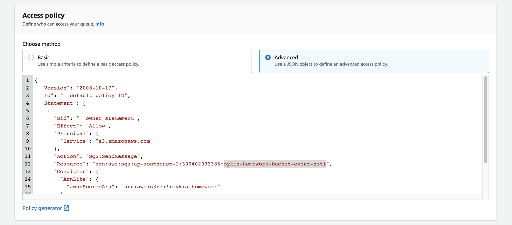
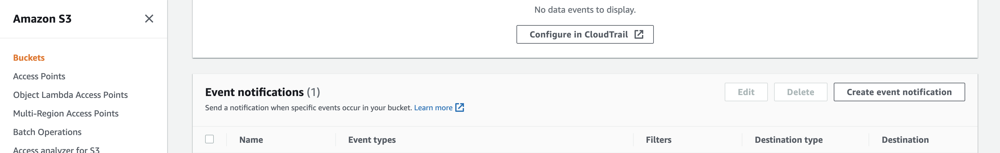
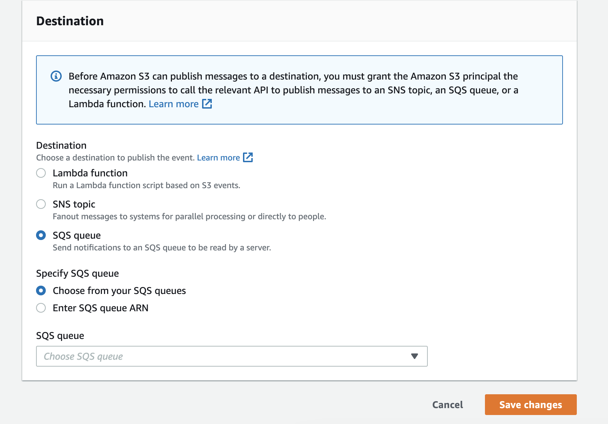

#Oyika Assignment Homework

AWS S3 bucket is an object storage used to store data such images. Now you have a bucket which contains many images. Build a sprint boot microservice with following functions
1) loop through the images in the S3 bucket
2) store them in mysql table (design your own table schema )
3) a simple fetchImages API to return all the images in the JSON response

Bonus:
The bucket is constantly updated with new image. Write an efficient logic to update these new image data in the mysql table.

## Technologies
1. Java 1.8
2. Spring Boot 2.7.7
3. S3
4. SQS

## System Design

Due to homework scope is creating microservice to handle image from S3 bucket, I ignored the Gateway layer and just focus
on design and develop image service, the system design is as below:


Step 1: Create a S3 bucket



Step 2: Create a SQS queue



And modify queue policy to alow S3 bucket push event to this queue



Step 4: Back to S3 bucket, and add notification event to SQS queue, I only choose 2 event types: ObjectCreated:Put and ObjectCreated:Post






Update application config:
Open application.properties file, then change database account and AWS pair key:
```
# MySql
spring.datasource.driver-class-name=com.mysql.cj.jdbc.Driver
spring.datasource.url=jdbc:mysql://localhost:3306/oyika
spring.datasource.username=root
spring.datasource.password=*******

# Spring Cloud AWS
cloud.aws.credentials.access-key=<your-access-key>
cloud.aws.credentials.secret-key=<your-secret-key>
cloud.aws.region.static=<your-region>
cloud.aws.stack.auto=false
sqs.queue.name=<your-queue-name>
s3.bucket_name=<your-bucket-name>
```


To run the application:

```shell
cd <project_root>
./mvnw spring-boot:run
```

API Endpoints:

* Get list images: GET localhost:8080/api/v1.0/images

* Scan S3 bucket and update to database: GET localhost:8080/api/v1.0/images/scan
